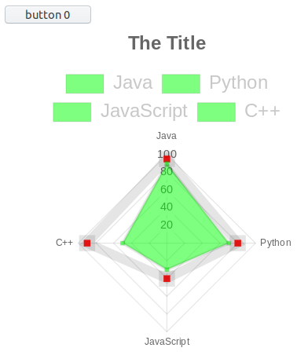

# p5
* drawing with p5
* see `p5-example.html` / `p5-example.js`

# JavaScript with NodeJS
* Node.js is a JavaScript runtime environment
* see example `main.js` - no html code only _pure_ JavaScript
* run with: `node main.js`

__npm__
* npm is a paket manager for Node.js
* a repository for libraries

The packages can be managed in a package.json file.
See also electron example: `electron-app/package.json`.

Create package.json file in current dir
```bash
npm init --yes
```

Example `package.json` with react dependencies.
```json
{
  "name": "app",
  "version": "0.1.0",
  "dependencies": {
    "react": "^18.2.0",
    "react-dom": "^18.2.0",
    "react-scripts": "5.0.1"
  }
}
```

Example for creating legacy react app
```bash
npm install create-react-app
npx create-react-app app
# start react app
npm start
```

# nextjs
* working dir: `nextjs/`

# hands-on chartjs
* display data, chart, ... with https://www.chartjs.org/
* example: chart.html (you have to include Chart.js)



# JavaScript in one file.
* Mainly using ES6
* from variables to objects
* also using a bit HTML and CSS
* dev environment is visual studio code and chrome (CTRL+SHIFT+I for dev tools)
* another option would also be pure JavaScript with the usage of Node.js

# cheatsheet: firefox developer
* webconsole: `CTRL + SHIFT + K`
* responsive design mode: `CTRL + SHIFT + M`
* debug in firefox: `CTRL + SHIFT K` > `Debugger` > set breakpoint

# tools for livecoding, hot reload, server, ...
* http-server
* browsersync
* python module simplehttpserver
